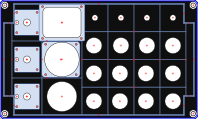
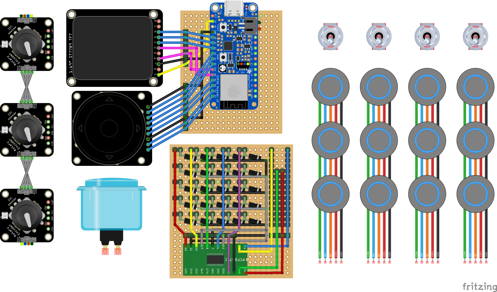

# ESP32 Game Controller
**WIP**

Design and CircuitPython code for a DIY macropad / game controller made with an ESP32-based microcontroller board.

## Parts
* [ESP32-S3 Feather](https://www.adafruit.com/product/5399) by [Unexpected Maker](https://esp32s3.com/feathers3.html)
* [I2C GPIO expander](https://www.adafruit.com/product/5611)
* [280x240px color TFT display](https://www.adafruit.com/product/5206)
* [directional nav+scroll rotary encoder](https://www.adafruit.com/product/5001) with [breakout](https://www.adafruit.com/product/5221)
* [30mm LED push button](https://www.aliexpress.us/item/3256803234603810.html?gatewayAdapt=glo2usa&_randl_shipto=US)
* 8x [16mm LED push buttons](https://www.adafruit.com/product/3350) ([alternate link](https://www.aliexpress.us/item/3256803363664141.html))
* 4x [19mm 3-position momentary rotary switches](https://www.aliexpress.us/item/3256803351410555.html)
* 4x [toggle switches](https://www.adafruit.com/product/3221)
* 3x [rotary encoders](https://www.adafruit.com/product/377) with [I2C breakouts](https://www.adafruit.com/product/4991)
* 25x [1N4148 Switching Diodes](https://www.adafruit.com/product/755)
* 2x [30x24 perfboard plates](https://www.adafruit.com/product/2670)
* [200x120x56mm project box](https://smile.amazon.com/dp/B09JYQ528P)

## Front Panel
[CAD model](design/front_panel.fpd)

## Wiring
[Fritzing diagram](design/wiring.fzz)

